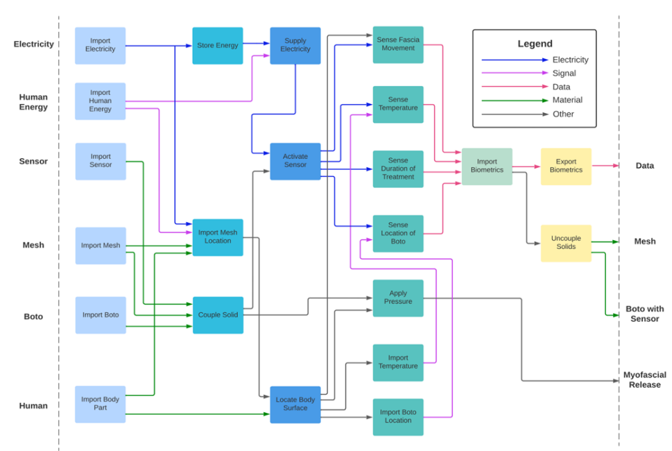
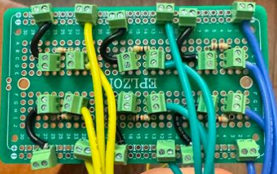
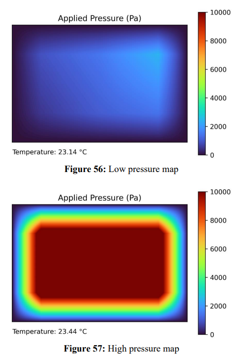
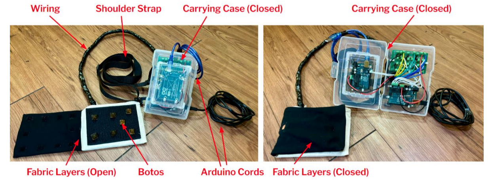

# Pyraboto
 PyraBoto: Wearable Sensor-Based Pain Management System for Neuromuscular Pathologies

# Description

PyraBack’s new concept (PyraBoto) will be a wearable product that can be used on any 
part of the body and provides treatment over an extended period. PyraBoto is based on the theories 
of Travell and Simons' Trigger Point Therapy and the McKenzie Method. The product will also 
incorporate Myofascial Release therapy and pain pathway research in its design. The device is 
intended to measure and report autonomic responses to deep pain through its biofeedback system.
The design team conducted a customer interview with the sponsor company to identify the 
specific needs of the product. The results concluded that comfort was the most important need
which was followed by customizability, biofeedback, and ease of use. These are required to ensure 
the user can wear the product for hours at a time while minimizing any potential struggles during 
use. The features will help the product stand apart from those similar to it in the market. The 
ultimate goal of PyraBoto is to develop a wearable pain management and muscle stimulation 
system for patients with neuromuscular pathologies. The optimal PyraBoto design must be a 
comfortable, adaptable, and intuitive system that utilizes a wearable material integrating a sensor 
feedback mechanism.

# Product

